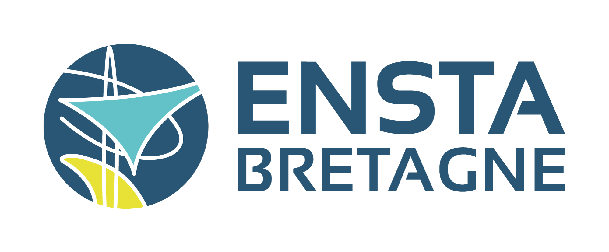
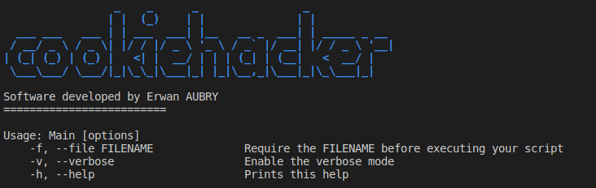

# CookieLang

**_Status_**

 

**_home_**

<https://github.com/erwanaubry/CookieLang>

**_rdoc_**

<https://ruby.github.io/rdoc>

**_bugs_**

<https://github.com/erwanaubry/CookieLang/issues>

## Description

Project purpose by the ENSTA-Bretagne school during my first degrees of Master in Cybersecurity. The objective is create a compiler for anything we want. I had choice to create a compiler for a new language, the CookieLang.

The compiler will be created in Ruby for rising my knowledge of IT language.

## Requirments

You will need of ruby on your computer to run this software :

    sudo apt install ruby-full

The list of package that I had used :

- strscan
- logger
- colorize
- optparse
- test/unit

## Run the software

To run the software, you must type this command on your favorite terminal : 

    ruby Main.py

After that, you must see it :

Like the help page you must specify a script developed in cookielang with the flag **-f**, like it : 

    ruby Main.py -f script.cookie

## Bugs
